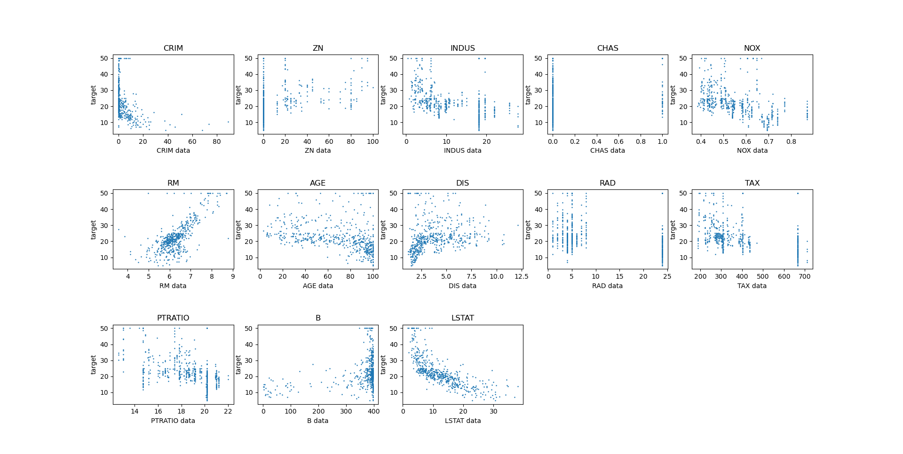
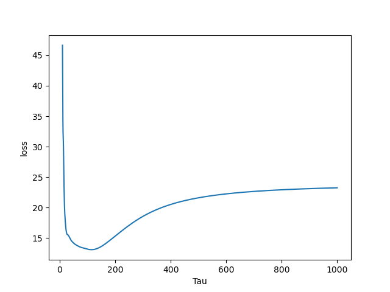

In this project we explore locally weighted linear regression compared to locally weighted regression and using kfold.

we first visualize the data and note that most variables are not linear so predicting house prices would likely fail using a linear model.

we note that tau gets larger and larger the graph begins to behave like a regular linear regression thus the loss increases. So at small taus we tend to overfit and high taus we under fit thus needing to tune this hyperparameter tau. 
